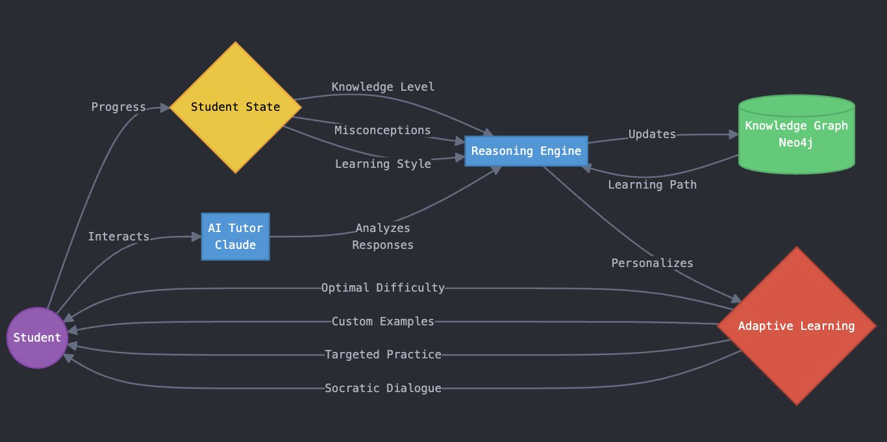

# # 🧮 Pythagore: AI-Powered Mathematics Tutor

## 🎯 Vision
Pythagore is an AI Mathematics tutor that aims to propose a new personalized learning experiencethrough a combination of Large Language Models and Knowledge Graphs. I'm building an AI tutor that truly understands each student's knowledge level, adapts its teaching approach in real-time, and provides personalized guidance through mathematics education.

## 🗺️ System Architecture

## 🧠 Core Architecture

### 🔄 Reasoning Layer
- **Knowledge Graph Integration**: Building a sophisticated reasoning layer on top of LLMs using Neo4j
- **Student Knowledge Mapping**: Real-time tracking and visualization of student understanding
- **Concept Dependencies**: Mapping mathematical concepts and their relationships
- **Adaptive Learning Paths**: Dynamic adjustment of content based on student's knowledge state

### 🧠 Intelligent Knowledge Mapping
- Dynamic knowledge graph that maps student understanding
- Real-time adaptation to student's learning pace and style
- Identification of knowledge gaps and misconceptions

### 🎓 Intelligent Tutoring

#### 🏛️ Socratic Teaching Method
- Guided discovery through strategic questioning
- Real-time verification of student comprehension
- Focus on mathematical reasoning and critical thinking
- Progressive concept building

#### 📊 Student Understanding Analysis
- Continuous assessment of knowledge gaps
- Misconception identification and correction
- Learning pace optimization
- Personalized feedback loops

### 🎯 Personalized Learning Experience
- Adaptive content difficulty based on student performance
- Custom-generated practice problems
- Interactive visualizations and explanations
- AI-generated podcasts using ElevenLabs for auditory learners

## 🛠️ Technology Stack
- **AI/ML**: Anthropic Claude, LangChain, PyTorch, Knowledge Graphs (Neo4j),
- **Backend**: Python, FastAPI
- **Voice Generation**: ElevenLabs API
- **Deployment**: Docker, Railway

--